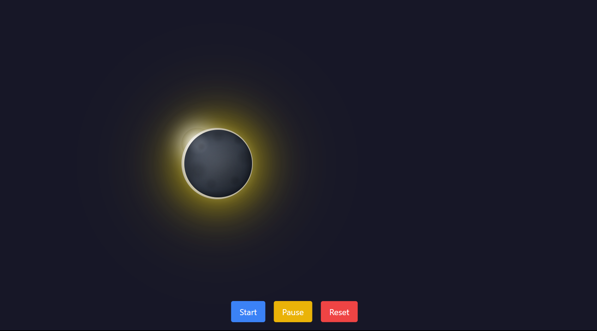

# Solar Eclipse Animation

## Objective

This project simulates a solar eclipse using React with Vite as the build tool, TailwindCSS for styling, and Framer Motion for animations. The animation depicts the Moon moving across the Sun, ultimately overlapping it and darkening the background.

## Features

- **Solar Eclipse Animation**: The Moon moves across the Sun, creating a solar eclipse effect.
- **Background Darkening**: The page background darkens when the Moon overlaps the Sun.
- **Smooth Animation**: Implemented using Framer Motion for smooth transitions.
- **Controls**: Buttons to start, pause, and reset the animation.
- **Responsive Design**: Designed with TailwindCSS to be responsive across various screen sizes.
- **Additional Effects**: Glowing effect around the Sun and subtle shadow effects during the eclipse.

## Acknowledgements

- Vite for fast builds and development.
- React for building the user interface.
- TailwindCSS for responsive and modular styling.
- Framer Motion for advanced animations.

---
## Image Preview

Here are preview image of the app:

